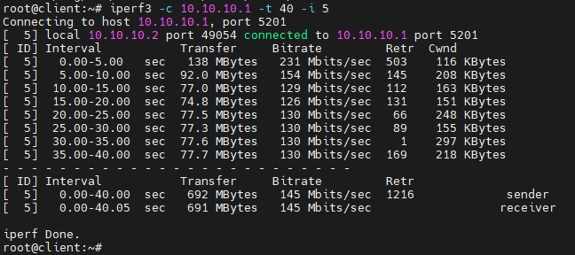
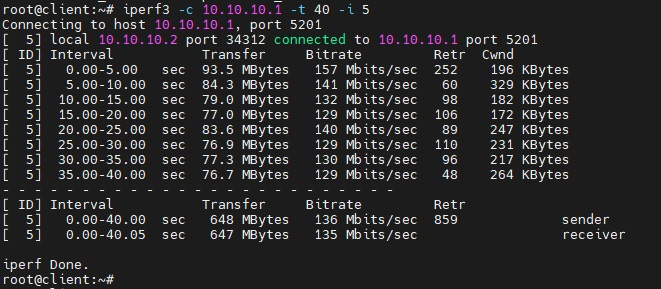

# Otus Homework 22. VPN.
### Цель домашнего задания
Создать домашнюю сетевую лабораторию. Научится настраивать VPN-сервер в Linux-based системах.
### Описание домашнего задания
1. Настроить VPN между двумя ВМ в tun/tap режимах. Замерить скорость в туннелях. Сделать вывод об отличающихся показателях
2. Поднять RAS на базе OpenVPN с клиентскими сертификатами, подключиться с локальной машины на ВМ
3. (*) Самостоятельно изучить и настроить ocserv, подключиться с хоста к ВМ
## Выполнение
С помощью _vagrant_ развернем тестовый стенд из двух виртуальных машин:
|Имя|IP-адрес|
|-|-|
|Server|192.168.56.10|
|Client|192.168.56.20|
  
На каждую ВМ установить _OpenVPN_, а также _iperf_ для тестирования пропускной способности туннеля.
```bash
apt update && apt install -y openvpn iperf3
```
На певром сервере сгенерируем файл ключ для впн сервера и скопируем его на второй
```bash
openvpn --genkey secret /etc/openvpn/static.key
```
Для _tap_ режиме конфигурационный файл сервера **server** будет выглядеть следующим образом:
#### /etc/openvpn/server.conf
```bash
dev tap 
ifconfig 10.10.10.1 255.255.255.0 
topology subnet 
secret /etc/openvpn/static.key 
comp-lzo 
status /var/log/openvpn-status.log 
log /var/log/openvpn.log  
verb 3 
```
На сервере **client** необходимо заменить IP-адрес на _10.10.10.2_. Создадим systemd unit для запуска сервера:
#### /etc/systemd/system/openvpn@.service
```bash
[Unit] 
Description=OpenVPN Tunneling Application On %I 
After=network.target 
[Service] 
Type=notify 
PrivateTmp=true 
ExecStart=/usr/sbin/openvpn --cd /etc/openvpn/ --config %i.conf 
[Install] 
WantedBy=multi-user.target
```
После чего запустим запустим OpenVPN сервер на обеих ВМ:
```bash
systemctl daemon-reload
systemctl start openvpn@server.service
systemctl enable openvpn@server.service
```
С помощью iperf замери скорость через впн туннель. На **server** запустим в режиме сервера:
```bash
iperf3 -s
```
На **client**:
```bash
iperf3 -c 10.10.10.1 -t 40 -i 5
```


Для изменения режима на _tun_, необходимо в обоих конфигурационных файлах изменить строчку `dev tun`.  

---
Ключевое отличие этих режимов в том, что **TAP** оперирует Ethernet кадрами работает на кальном уровне модели OSI, в то время как **TUN** работает непосредственно с IP-адресами на сетевом уровне.

---
Применим изменения, перезапустив службу и снова измерим пропускную способность:
```bash
systemctl restart openvpn@server.service
```


В нашем случае в рамках тестовой среды результаты примерно одинаковые. На практике _tun_ режим обладает более высокой производительность и испытывает меньшую нагрузку, так как он работает работает только с IP-пакетами и не занимается обработкой широковещательных пакетов, которые могут потребовать дополнительных ресурсов.
